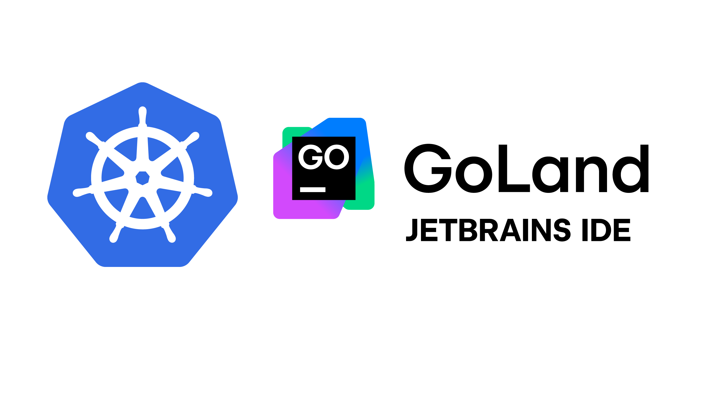

# Kubernetes with GoLand


### Prerequisites

Before starting up this project, make sure you have the necessary dependencies installed in your machine.

###  Installation

- [x] [Go](https://go.dev/) - Go is an open source programming language that makes it simple to build secure, scalable systems.

- [x] [Docker](https://www.docker.com/) - Docker helps developers bring their ideas to life by conquering the complexity of app development.

- [x] [PostgreSQL](https://www.postgresql.org/) - The World's Most Advanced Open Source Relational Database


#### Running Postgres Database

```bash
docker run --name goland-k8s-demo -p 5432:5432 -e POSTGRES_PASSWORD=mukul123 -d postgres
```

### DockerHub

If you'd like to try out the application without any installation, you can download the Docker [image](https://hub.docker.com/r/mukulmantosh/go_k8s/tags).

<hr/>

Copyright © 2024 [JetBrains](https://www.jetbrains.com/) s.r.o. JetBrains and the JetBrains logo are trademarks of JetBrains s.r.o.